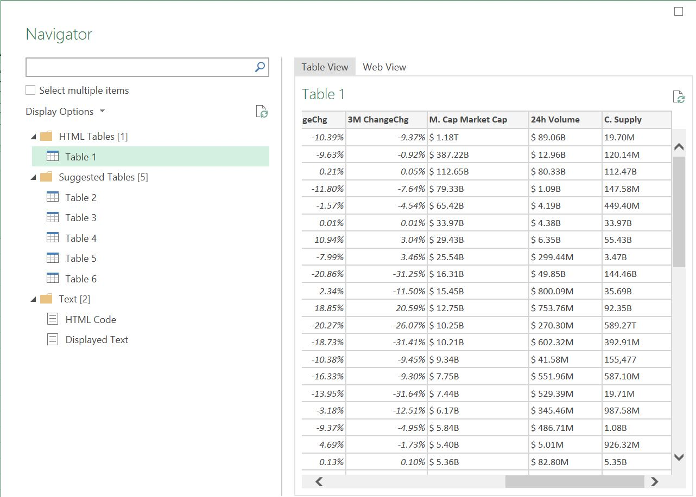
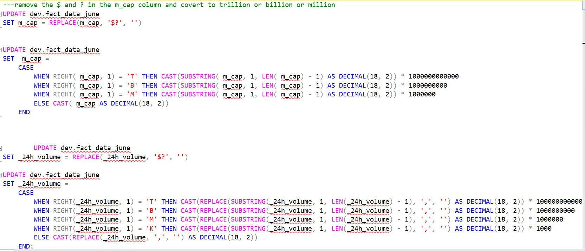
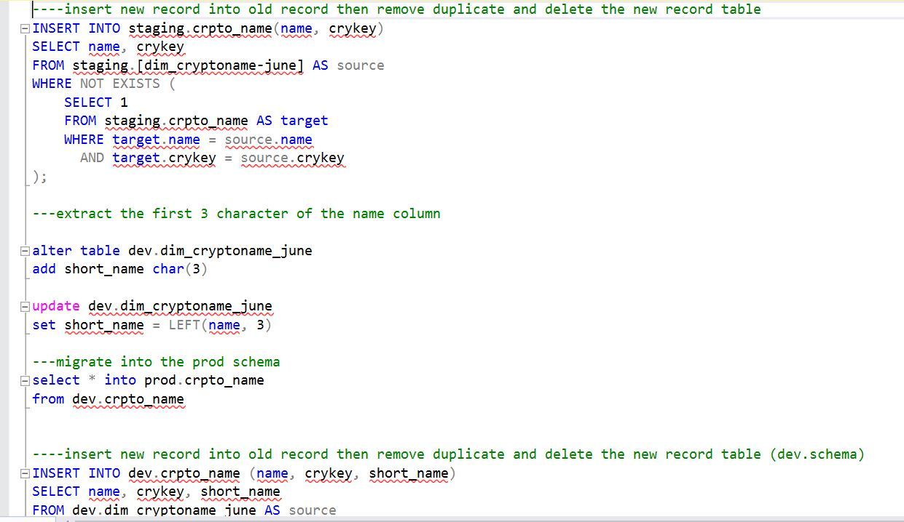

# Cryptocurency price movement 
This guide provides a detailed process for tracking daily cryptocurrency price movements and monitoring them to make informed investment decisions

# Introduction 
In 2024, cryptocurrency markets have evolved rapidly, influenced by technological advancements, regulatory changes, macroeconomic factors, and market sentiment. Significant updates in blockchain technologies, such as Ethereum 2.0's transition to a proof-of-stake consensus mechanism, have enhanced scalability, security, and functionality, attracting more users and investors. The adoption of layer 2 solutions like Optimistic and zk-Rollups has addressed scalability issues, while interoperability protocols have promoted a more interconnected ecosystem. 

The regulatory landscape has seen substantial changes, with governments and regulatory bodies worldwide providing clearer guidelines. In the United States, the SEC and CFTC have clarified regulations around cryptocurrency trading, ICOs, and DeFi platforms. The European Union's implementation of the Markets in Crypto-Assets (MiCA) regulation has provided a unified framework across member states, enhancing investor protection and market integrity. Meanwhile, countries like China and India have introduced central bank digital currencies (CBDCs) while maintaining stringent regulations on private cryptocurrencies. 

Global economic conditions have also significantly influenced cryptocurrency prices. Persistent inflation and the monetary policies of major central banks, particularly in the US and Europe, have impacted investor behavior, with cryptocurrencies often seen as a hedge against inflation. Geopolitical tensions and conflicts have increased market volatility, with cryptocurrencies perceived as safe-haven assets during times of uncertainty. These factors collectively shape the dynamic and volatile cryptocurrency market landscape in 2024. 

## Objectives 
The aim of this project is to inform individuals, governments, and stakeholders to make informed decisions before investing in cryptocurrency, especially in the current year. By understanding the key factors affecting cryptocurrency prices, investors can make strategic and wise investment decisions, minimizing potential losses and maximizing gains in the dynamic and volatile cryptocurrency market. 

Understanding the various factors that affect cryptocurrency price movements is essential for making informed investment decisions. These factors include: 

**Market Sentiment and Adoption**: Investor perception and behavior significantly influence cryptocurrency prices. Positive news, endorsements from influential figures, and increased adoption by businesses and consumers can drive prices up, while negative news and market skepticism can lead to declines. 

**Macroeconomic Factors**: Economic conditions such as inflation, interest rates, and overall economic stability impact investor behavior. Cryptocurrencies are often seen as a hedge against inflation and economic uncertainty, leading to increased demand during such times. 

**Regulatory Environment**: Government regulations and policies significantly affect cryptocurrency markets. Clear regulations can provide stability and attract investors, while restrictive policies can hinder market growth and cause price volatility. 

**Technological Developments**: Advances in blockchain technology, such as scalability improvements and new security features, can enhance the functionality and attractiveness of cryptocurrencies, influencing their market value. 

**Government Policies**: Government actions, including the introduction of central bank digital currencies (CBDCs) and specific regulations on cryptocurrency usage, can have profound effects on market dynamics. 

## Tool used  
- Microsoft excels  
- Microsoft SQL server  Microsoft power bi desktop (for report development) 
- Microsoft fabric for efficiently manage report and real time analysis

## Data Source and Preparation 
The dataset used in this analysis was sourced from CoinDex, a website that provides extensive historical data on _cryptocurrencies_ spanning many years. The data was scraped using Power Query in Microsoft Excel, where basic sorting was performed before importing it into Microsoft SQL Server for further data cleaning and processing. The dataset consists of three tables: two-dimension tables and one fact table. 

### Data Transformation 

The data cleaning process follows a structured approach using a medallion architecture, consisting of three schemas: staging, dev, and prod. This multi-layered approach ensures thorough data transformation and preparation. 

1. **Staging Schema**: Data ingestion begins in the staging schema, where raw data is initially loaded. 

2. **Dev Schema**: The data is then migrated to the dev schema for comprehensive data transformation. Key transformations include: 

   - **Price Column**: Removing the "$" and "?" symbols. 

   - **Percentage Columns**: Converting 24h, 7d, 1m, and 3m columns to four decimal points. 

   - **Market Cap Column**: Removing "$" and "?" symbols, and converting values to millions, billions, or trillions. 

   - **24h Volume Column**: Removing "$" and "?" symbols, and converting values to millions, billions, or trillions. 

   - **Circulating Supply Column**: Converting values to millions, billions, or trillions. 

3. **Dimension Tables**: Transformations include concatenating columns in the date table to create a single date column, which is then used to extract various date attributes such as year, month, and week. 

After the necessary transformations in the dev schema, the cleaned data is migrated to the prod schema for reporting purposes. This methodical approach ensures the data is well-prepared and accurate for analysis. 

transformation 1                      |    transformation 2
--------------------------------      |   -----------------------------------
              |      

###Data Modelling 
I designed the star schema model to connect all facts and dimensions seamlessly. By utilizing the import storage mode, I imported the data into Power BI and established relationships between the tables. Most relationships are characterized by one-to-many cardinality with a single filter direction, ensuring efficient data flow and accurate analysis, as illustrated in the screenshot below. 

#### Bitcoin (BTC) 

Bitcoin (BTC) reached an all-time high (ATH) of $72,346 on April 8, 2024, with a total market cap of $25.04 trillion and a circulating supply of 274.28 million BTC. As the pioneer cryptocurrency, Bitcoin continues to dominate the market, with its ATH marking a significant milestone that reflects strong investor confidence and market demand. The substantial market cap underscores Bitcoin's role as a primary store of value and investment asset in the crypto space. 

#### Ethereum (ETH) 

Ethereum (ETH) achieved an all-time high of $3,865.71 on May 28, 2024, with a total market cap of $7.91 trillion and a circulating supply of 2.28 billion ETH. This milestone highlights Ethereum's crucial role in the cryptocurrency ecosystem, particularly due to its smart contract capabilities and its pivotal role in decentralized finance (DeFi) and non-fungible tokens (NFTs). The $7.91 trillion market cap reflects Ethereum's extensive use cases and its adoption beyond merely being a digital currency. 

#### Binance Coin (BNB) 

Binance Coin (BNB) peaked at $622.34 on April 12, 2024, with a total market cap of $1.66 trillion and a circulating supply of 2.80 billion BNB. This peak signifies BNB's significant position within the Binance ecosystem, providing utility in transaction fees, DeFi, and as a form of payment. The $1.66 trillion market cap indicates substantial growth and acceptance within the crypto community. 

#### Solana (SOL) 

Solana (SOL) reached an all-time high of $196.52 on April 1, 2024, with a current price of $162.99, a total market cap of $1.41 trillion, and a circulating supply of 8.53 billion SOL. Solana's rapid ascent in the cryptocurrency market is driven by its high throughput and low transaction costs. The ATH showcases its competitive strength in the blockchain space, and its substantial market cap indicates its significant presence and potential for future growth. 

### Conclusion 
The analysis of major cryptocurrencies in 2024 highlights the dynamic nature and rapid growth of the cryptocurrency market. Bitcoin, with its all-time high of $72,346 and a staggering market cap of $25.04 trillion, continues to be the leading store of value and a primary investment asset, reflecting strong investor confidence. Ethereum, reaching a peak of $3,865.71 and boasting a market cap of $7.91 trillion, underscores its critical role in enabling smart contracts, DeFi, and NFTs, demonstrating its extensive adoption and diverse use cases. 

Binance Coin's peak at $622.34 and a market cap of $1.66 trillion signify its integral role within the Binance ecosystem, providing essential utility in various applications, including transaction fees and DeFi. Solana's impressive rise to an all-time high of $196.52 and a market cap of $1.41 trillion illustrates its competitive edge in the blockchain space, driven by its high throughput and low transaction costs. 

Overall, these insights emphasize the substantial growth and significant potential of the cryptocurrency market, with each of these leading cryptocurrencies playing distinct yet pivotal roles in shaping the future of digital finance. Investors and stakeholders must consider these factors when making informed decisions in this evolving landscape. 

### Recommendations for Stakeholders Before Investing in Cryptocurrency 

1. **Market Demand**: The recent all-time highs indicate a surge in investor interest and widespread adoption of cryptocurrencies. This trend suggests a growing acceptance and potential for further value increases. 

2. **Technological Advancements**: Continuous upgrades and innovations in blockchain technologies enhance the functionality and security of cryptocurrencies, contributing to their increasing valuations. Staying informed about these advancements can help investors identify promising investment opportunities. 
4. **Regulatory Environment**: Regulatory clarity and acceptance are crucial for market stability and growth. Understanding the current regulatory landscape and potential future regulations can help investors mitigate risks and make more informed decisions. 
5. **Institutional Involvement**: Increased participation from institutional investors and mainstream financial institutions significantly boosts market capitalization and prices. This involvement indicates a maturation of the cryptocurrency market and provides a level of validation and confidence for individual investors. 
6. **Economic Factors**: Macro-economic conditions, such as inflation, interest rates, and monetary policies, influence the attractiveness of cryptocurrencies as an investment. Investors should consider these economic indicators to better understand the potential impact on cryptocurrency prices and overall market dynamics. 

By carefully analyzing these factors, stakeholders can make more informed and strategic investment decisions in the rapidly evolving cryptocurrency market. 

 

 

 
